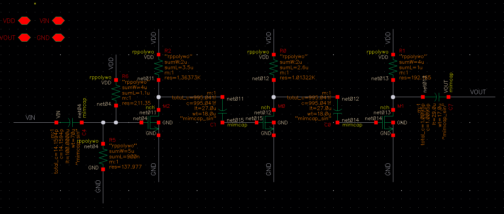
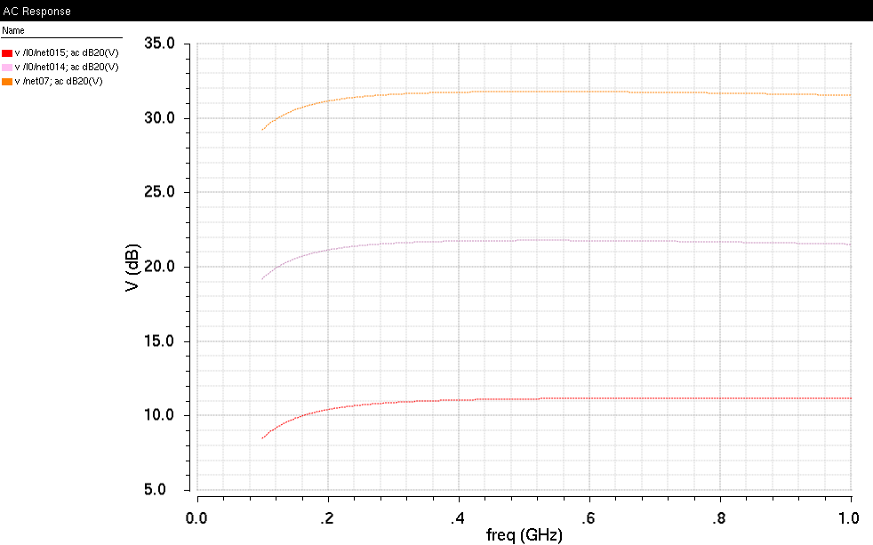
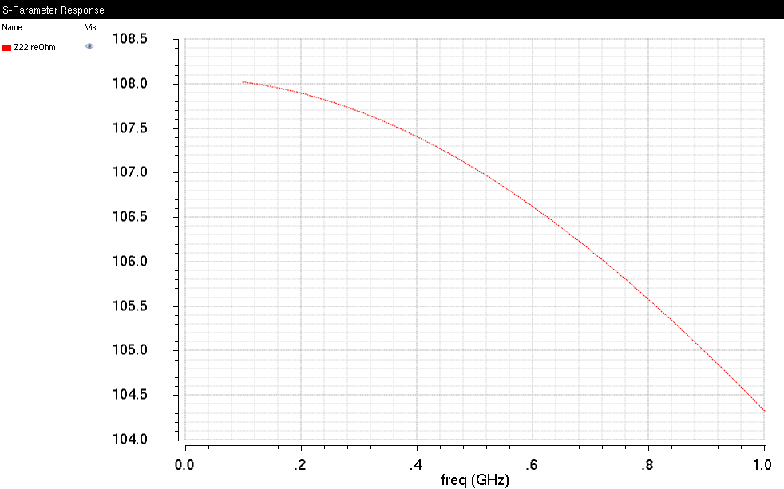
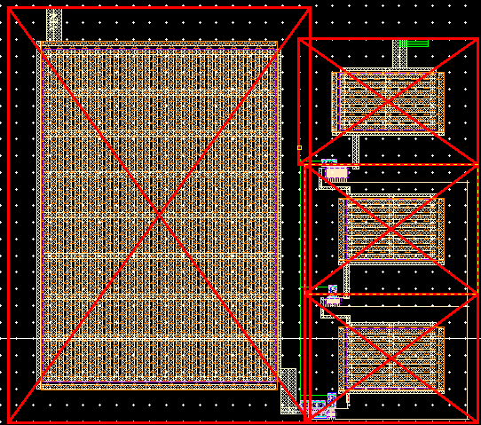
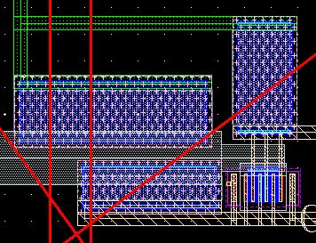
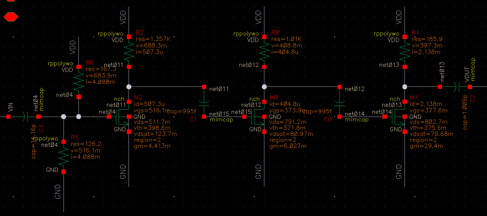

# Virtuoso-Design-Project
### SoC Design Term Project! 3-Stage Amplifier

------
## Circuit Definition
- Voltage gain : at least 30dB
- Supply Voltage : 1.2V
- Current consumption : 20mA
- Phase : 180°
- 3dB Bandwidth > 500 Mhz with 1pF Loading capacitor
- Input impedance : 30Ω to 70Ω
- Output impedance : 80Ω to 120Ω
- Can't use Ideal element

------
## Schematic
> ## Circuit Design (Before PEX)
>
>>
>>
>>

------
## Layout
> ## Layout Design
>
>

------
## PEX
> ## Circuit Design (After PEX)
>

------